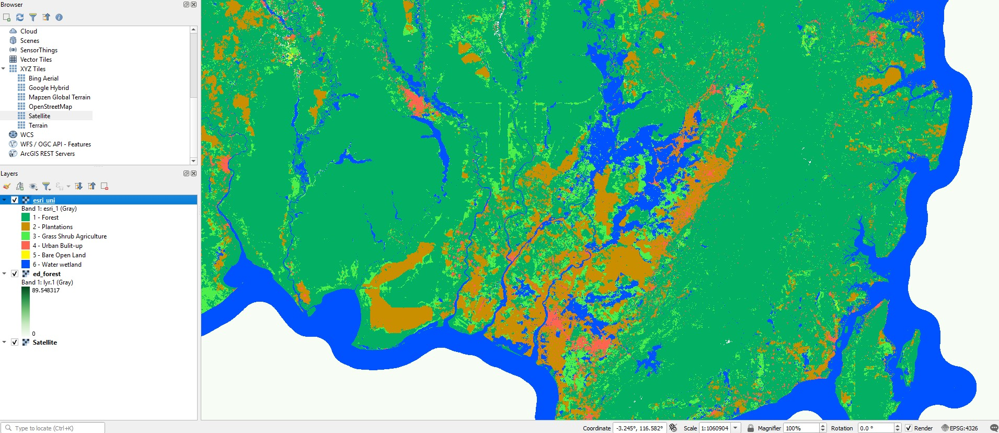
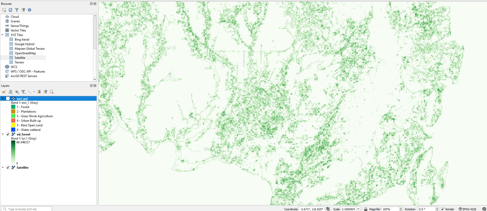

# Landscape Metrics Radius

`landscape-metrics-radius` is an R workflow to compute class-level landscape metrics from a categorical land-cover raster using circular moving windows. It was developed for the ZOOMAL project, but the script is designed to be reusable for any study area where users need landscape metrics from a raster, optionally clipped by a shapefile or other vector AOI.

The workflow is useful when you want to generate spatial predictors such as forest proportion, edge density, clumpiness, aggregation, nearest-neighbour distance, or perimeter-area ratio around regular grid cells.

---

# Main features

- Input categorical land-cover raster (`.tif`)
- Optional AOI clipping using shapefiles or vector data
- Raster reprojection to metric CRS
- Optional exclusion of classes such as clouds
- Raster aggregation for faster processing
- Circular moving-window analysis
- Chunk-based processing
- Parallel computing using PSOCK clusters
- Export of:
  - long-format CSV tables
  - GeoTIFF rasters for each metric and class

---

# Repository structure

```text
landscape-metrics-radius/
├── R/
│   ├── compute_landscape_metrics.R
│   └── legacy_zoomal_missing_metrics.R
├── config/
│   ├── example_command_windows.txt
│   └── example_command_linux_mac.sh
├── docs/
│   ├── input_example.jpg
│   └── output_example.jpg
├── data/
├── outputs/
├── CITATION.cff
├── LICENSE
├── .gitignore
└── README.Rmd
```

---

# Installation

Install required packages in R:

```r
install.packages(c(
  "terra",
  "landscapemetrics",
  "data.table",
  "parallel"
))
```

---

# Example input and output

Below is an example of the workflow using a land-cover raster from the ZOOMAL project in Borneo.

The first image shows the categorical land-cover raster used as input.  
The second image shows an example output landscape metric raster generated by the workflow (`Edge Density` for the forest class).

---

## Example input raster



---

## Example output raster



---

# Quick start

## Windows

```bash
Rscript R/compute_landscape_metrics.R ^
  --input "data/zoomal_landcover.tif" ^
  --out_dir "outputs" ^
  --aoi "NULL" ^
  --crs "EPSG:3857" ^
  --radius 500 ^
  --out_res 1000 ^
  --agg_res 100 ^
  --chunk_size 500 ^
  --workers 3 ^
  --save_chunks TRUE ^
  --exclude_codes "7"
```

---

# Computational considerations

The processing time and memory usage strongly depend on:

- spatial extent;
- raster resolution;
- aggregation resolution;
- moving-window radius;
- number of metrics;
- number of workers.

Large study areas combined with high spatial resolution can substantially increase processing time and RAM consumption.

## Example processing complexity

| Scenario | Expected performance |
|---|---|
| Small AOI + 100 m raster + 500 m radius | Fast |
| Regional AOI + 30 m raster + 1 km radius | Moderate |
| Country-scale AOI + 10 m raster + 5 km radius | Very heavy |

Metrics such as:

```text
lsm_c_enn_mn
lsm_c_para_mn
```

are computationally intensive because they require neighbour and geometry calculations.

---

# Outputs

```text
outputs/
├── landscape_metrics_long.csv
├── lsm_c_pland_forest.tif
├── lsm_c_ed_forest.tif
└── ...
```

---

# Funding

This study was funded by the ZOOMAL project (“Evaluating zoonotic malaria and agricultural land use in Indonesia”; #LS-2019-116), Australian Centre for International Agricultural Research (ACIAR), and the Indo-Pacific Centre for Health Security, Department of Foreign Affairs and Trade, Australian Government. BFS was supported by a James Cook University Postgraduate Research Scholarship.

---

# Author

**Dr. Cesar Alvarez**  
University of Augsburg  
Augsburg, Germany

Email: cesar.alvarez@uni-a.de

---

# License

MIT License.